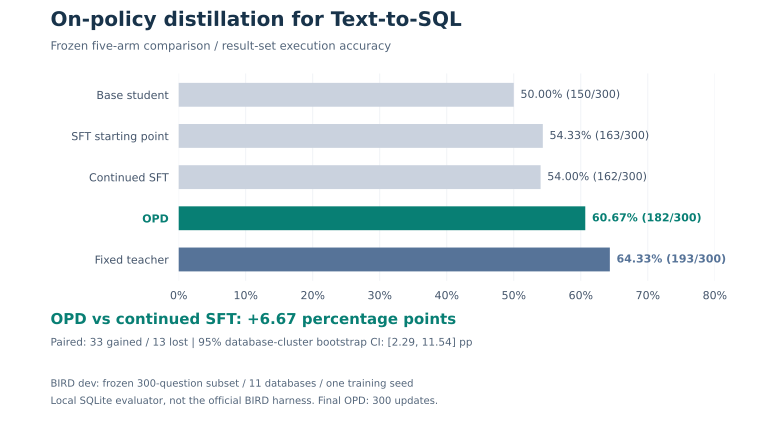
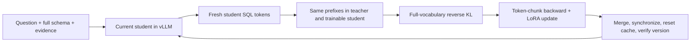

# OPD SQL Agent

### Learn from the SQL your student actually generates.

[中文说明](README.zh-CN.md) · [Quickstart](#try-it-on-a-cpu) · [Results](docs/results.md) · [Architecture](docs/architecture.md) · [Reproduction](docs/reproduction.md)

[](pyproject.toml)
[](LICENSE)
[](https://github.com/lite93597/opd-sql-agent/actions/workflows/tests.yml)

**A readable training and evaluation toolkit for on-policy Text-to-SQL distillation:** a frozen teacher scores the student's own prefixes, and a LoRA student learns with full-vocabulary reverse KL. PyTorch handles training; vLLM handles generation; SQLite checks what the queries actually return.

**Observed result:** on a frozen **BIRD dev subset of 300 questions across 11 databases**, a 9B student reached **60.67% execution accuracy**, compared with **54.00% for continued SFT from the same starting adapter**: **+6.67 percentage points**, 33 gained / 13 lost questions. This is one training seed with a local evaluator, not an official BIRD leaderboard result.



## What you can reuse

- **Read the actual algorithm.** The synchronous PyTorch loop samples fresh student trajectories, evaluates the frozen teacher on the same prefixes, and optimizes `KL(student || teacher)` over the entire output vocabulary.
- **Keep full schemas within a declared budget.** Token-position chunks release large KL graphs early; hidden-state gradients then flow back through the student backbone. An exact 8192-token backward / optimizer / synchronization probe passed; the longest observed training sequence was 7137 tokens.
- **Keep rollout weights current.** Version checks, LoRA merging, NCCL parameter transfer, prefix-cache reset, and greedy checks connect the trainable student to its vLLM replica.
- **Compare effects, not just losses.** Database-disjoint internal validation, frozen checkpoint selection, paired gained/lost analysis, and database-cluster bootstrap intervals make the experiment inspectable. The unsuccessful 600-step branch is included.
- **Start small.** Run a synthetic SQLite evaluation demo on a CPU before downloading datasets or models.

This repository is useful for studying distillation internals, adapting SQL evaluation, and building controlled experiments. Model weights, adapters, BIRD databases, and private operational logs are not bundled.

## Try it on a CPU

Python 3.10+ is enough for the core evaluator. No GPU, PyTorch, model download, or BIRD download is required for this demo.

```bash
git clone https://github.com/lite93597/opd-sql-agent.git
cd opd-sql-agent
python -m venv .venv
# Linux / macOS:
source .venv/bin/activate
# Windows PowerShell: .\.venv\Scripts\Activate.ps1
python -m pip install -e .
python scripts/demo.py
```

The demo creates a tiny synthetic database and **hand-authored predictions** under `work/demo/`. It demonstrates execution checking, paired comparison, and the difference between row-set and row-multiset equality. Its scores are not model or training results. An existing output directory is rejected; use `--output-dir work/demo-2` for another run.

Evaluate those exported predictions through the public CLI:

```bash
python -m opd_sql.bird_evaluation \
  --records work/demo/records.jsonl \
  --predictions work/demo/candidate-predictions.jsonl \
  --comparison-predictions work/demo/reference-predictions.jsonl \
  --output work/demo/cli-report.json
```

See [the examples guide](examples/README.md) for input formats and CPU test commands. PowerShell users can place CLI options on one line.

## The experiment, without the headline shortcuts

Student: **Qwen3.5-9B**. Fixed teacher: **Qwen3.8-27B**. Both used pinned model snapshots and matching tokenizer mappings. The system prompts for a single read-only SQLite query, with full schema and supplied evidence, and disables thinking output.

| Frozen final arm | Correct / 300 | Execution set equality | Strict row multiset: correct / 300 |
|---|---:|---:|---:|
| Base student | 150 | 50.00% | 135 |
| Fixed teacher | 193 | 64.33% | 177 |
| SFT starting adapter S0, 300 updates | 163 | 54.33% | 147 |
| Continued SFT from S0, 300 updates | 162 | 54.00% | 148 |
| OPD from S0, LR 1e-5, 300 updates | **182** | **60.67%** | **165** |

OPD minus continued SFT: **+20 correct**, **+6.67pp**, database-cluster bootstrap 95% interval **[2.29, 11.54]pp**. SFT warm-up alone contributed **+4.33pp over Base**; Base-to-OPD's +10.67pp includes that contribution.

All arms retain the fixed denominator of 300. One common gold query timed out and is incorrect for every arm. The primary metric ignores duplicate rows; the strict metric preserves duplicate counts. Neither compares SQL strings or proves equivalence on every possible database.

**Negative result:** the extra 600-update, LR 5e-6 OPD branch reached **67/120** on internal validation versus **72/120** for its endpoint SFT control. Its best internal score did not exceed the first OPD branch, so the predeclared selection kept the original 300-update pair. The 600-update model was not added to the final test.

**Limits:** one seed, a 300-question subset, and a local SQLite evaluator rather than the official harness. The two branches match initialization, sample order, and update count, but use different learning rates and unequal token/compute budgets. Positive bootstrap intervals do not establish cross-seed reproducibility or isolate every algorithmic factor.

[Full results and selection details →](docs/results.md) · [Public aggregate evidence →](artifacts/experiment-v1/README.md)

## How on-policy distillation works here



At each completion prediction position:

```text
q(v) = student's next-token probability
p(v) = frozen teacher's next-token probability
KL(q || p) = sum_v q(v) * (log q(v) - log p(v))
loss = sum of completion-position KL / total completion tokens
```

The generation itself is discrete and has no gradient. Training recomputes the student's differentiable forward pass on the sampled tokens; the teacher runs without gradients. This implementation optimizes conditional token distributions and does not add a REINFORCE sampling-gradient term.

SFT uses completion-only cross-entropy against BIRD gold SQL. OPD uses no gold-SQL term in its loss. Chunking is over token positions, **not top-k vocabulary truncation**. The training loop is custom PyTorch; TRL supplies the vLLM client, not a PPO/GRPO trainer.

## GPU training and reproduction

The recorded experiment ran on **Linux with 2 × 96GB RTX PRO 6000 Blackwell GPUs**: GPU 0 holds teacher + trainable student; GPU 1 runs vLLM. It is role separation, not tensor/data parallel training or one combined 192GB device.

Core settings: LoRA `r=8`, `alpha=16`, dropout 0; 5,898,240 trainable parameters; microbatch 1, accumulation 4; context 8192, generation cap 512; KL chunks of 8 positions; BF16 model weights and FP32 probability calculations. Every update performs full parameter synchronization rather than adapter-only transfer.

The exact recorded GPU package pins are in [scripts/server/requirements.txt](scripts/server/requirements.txt); CUDA 13 / Blackwell build details and the separately installed causal-conv1d dependency are documented in [reproduction](docs/reproduction.md). These GPU scripts target the original Linux directory layout and require verified model-download manifests, prepared BIRD data, and an S0 adapter. They are **not** a fresh-clone, one-command GPU reproduction.

The data protocol uses 55 training databases / 7231 questions and 14 internal validation databases / 2197 questions. Length eligibility leaves a common pool of 6216 questions without schema truncation. Each 300-update branch actually consumes 1200 distinct questions. Internal 120 questions select checkpoints; final dev300 excludes the earlier dev120 question IDs and is evaluated after selection is frozen.

[GPU preparation, configuration, and CLI entry points →](docs/reproduction.md)

## Find the part you need

| Area | Entry point |
|---|---|
| Full-vocabulary KL, policy sync, checkpoints | [src/opd_sql/onpolicy.py](src/opd_sql/onpolicy.py) |
| Completion-only supervised training | [src/opd_sql/supervised.py](src/opd_sql/supervised.py) |
| Prompt and token construction | [src/opd_sql/prompts.py](src/opd_sql/prompts.py) |
| Read-only SQLite execution and limits | [src/opd_sql/sqlite_tools.py](src/opd_sql/sqlite_tools.py) |
| Portable evaluation CLI | [src/opd_sql/bird_evaluation.py](src/opd_sql/bird_evaluation.py) |
| Dataset download, preparation, isolation | [scripts/data/](scripts/data/) |
| Stage reuse and frozen experiment orchestration | [scripts/server/run_effect_experiment.py](scripts/server/run_effect_experiment.py) |
| Paired statistics and protocol auditing | [scripts/analysis/summarize_effect.py](scripts/analysis/summarize_effect.py) |

`configs/*7b.json` are historical Qwen2.5 reference configurations, not the recipe behind the published 9B/27B result. See [configuration notes](configs/README.md).

## Contribute

Useful contributions include CPU evaluator edge cases, documented GPU portability fixes, more efficient synchronization with correctness checks, and independent multi-seed comparisons. Please keep dataset versions, split IDs, generation settings, and negative results visible. See [CONTRIBUTING.md](CONTRIBUTING.md).

If the implementation or evaluation protocol helps your work, a **Star** helps other developers find it. Download via `git clone` or [the source ZIP](https://github.com/lite93597/opd-sql-agent/archive/refs/heads/main.zip).

## License and attribution

Project code is released under [MIT](LICENSE). BIRD data and model weights retain their upstream licenses and are not distributed here. See [NOTICE.md](NOTICE.md) for BIRD attribution and third-party boundaries. The public JSON files are documented aggregate derivatives with original source hashes, not bundled raw datasets or adapters.
